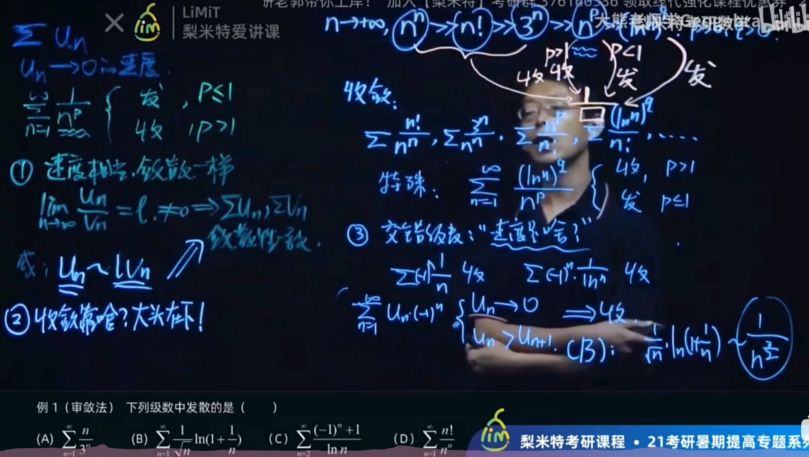
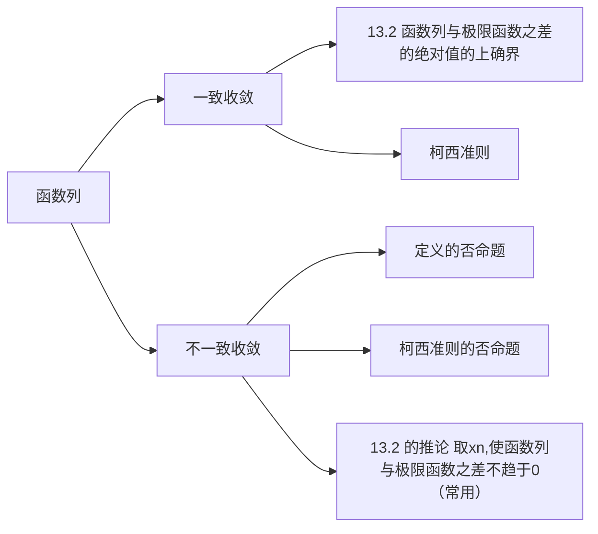
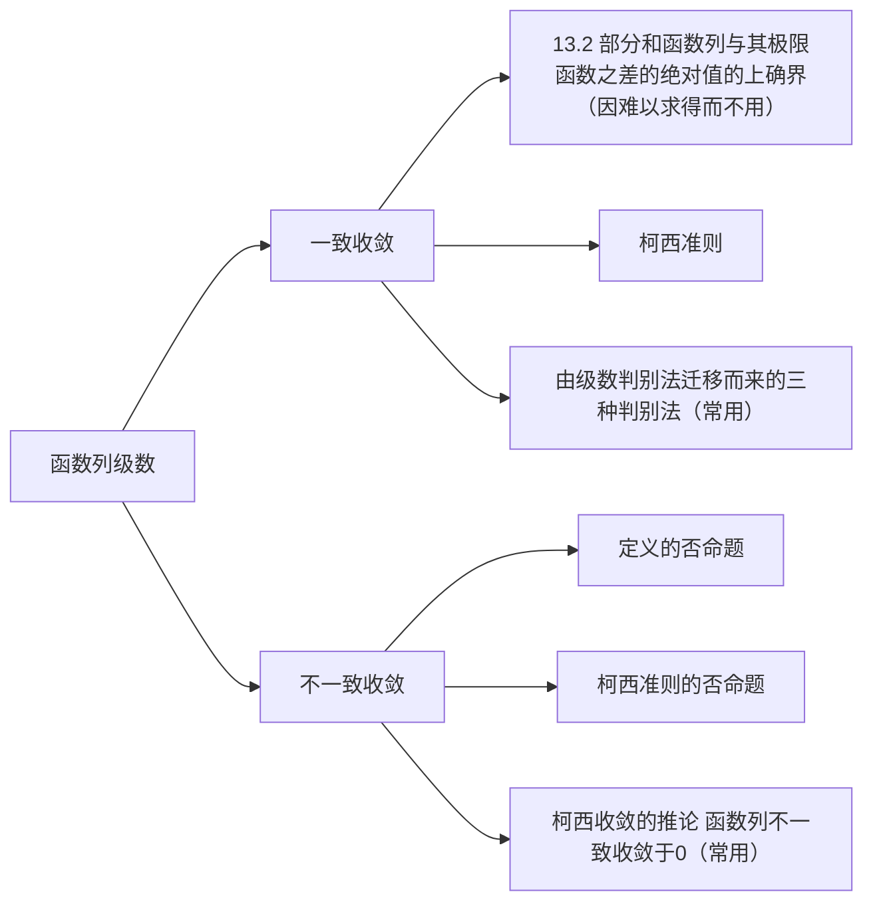

---
#2.9日志
#需完善的部分：警告框处理
#Mermaid优化
#将现有数分文件做进一步细化(比如每几章设置一个md文件)
#社交卡片拓展包
---

# 数学分析Ⅱ（H）

## 第十二章 数项级数

###  $\S0\,预备：上极限与下极限$

定义：

上极限： $\overline{A}=\lim\limits_{n\to\infin}  \sup\,{a_n}$

下极限： $\underline{A}=\lim\limits_{n\to\infin}  \inf\,{a_n}$

有如下重要定理：

- **定理 7.4 有界数列至少有一个聚点，且存在最大聚点和最小聚点**

这里的最大聚点和最小聚点分别是上下极限的另一种定义，证明时类似于聚点定理的证明，只是在选取子区间时，若优先选择右边的区间，则得到的是最大聚点，最小聚点同理.

- **定理 7.5 对任何有界数列$\mathrm\{x_n\}: \underline {\lim \limits_{n \to \infty}}x_n \le \overline{\lim \limits_{n \to \infty}}x_n$**

- **定理 7.6 $\lim\limits_{{n \to \infty}} x_n = A \iff \overline{A}=\underline{A}$**

!!! note
    极限的性质(如保号性，保序性)同样适用于上下极限

### $\S1\,级数敛散性$

#### 1. 级数定义
   给定一个数列${u_n}$，将它的各项依次用加号连接起来的表达式称为**常数项无穷级数**或**数项级数**（简称**级数**）$u_n$称为级数的通项

#### 2. 级数敛散性刻画：以部分刻画整体

   定义**部分和$S_n$** 为数列前n项和，它也构成一个数列 **若这个数列收敛于常数S 就称级数收敛**，S为数项级数的和，

   也即$u_n$对应级数的敛散性与数列$S_n$敛散性相同

##### 定理 12.1 级数收敛的柯西准则

   级数收敛$\iff \forall\epsilon>0,\exists N, \forall m>N及正整数p，都有|u_{m+1}+\dots+u_{m+p}|<\epsilon$

   **它的逆否命题十分有用**

   推论 级数收敛的必要条件 $\lim\limits_{n\to\infty}u_n=0$

#### 3. 重要级数
   等比级数 |q|<1时收敛 |q|$\ge$ 1发散

   调和级数 $\sum \frac{1}{n}$发散(证明：Cauchy收敛的逆否命题)

   但$\sum\frac{1}{n^2}$收敛

#### 4. 级数性质（定理12.2至12.4）

   - $\sum(cun+dvn)=c\sum u_n + d\sum v_n$

   - 去掉增添改变级数的有限个项不改变敛散性

   - **任意加括号不改变敛散性及级数之和**

     这点在级数计算中十分重要

### $\S2 正项级数$

各项都是非负数即称正项级数.

我们继续讨论正项级数的敛散性（负项只需加一个负号即可）

类比单调有界定理，我们有：

#### 定理 12.5 正项级数的单调有界定理

#### $正项级数\sum u_n收敛\iff部分和数列{S_n}有界$

证明是简单的 因为部分和数列本身是单调的，其有界等价于级数收敛

#### 定理 12.6 比较原则

 其极限形式的推论很重要

$$
\begin{aligned}
&\sum u_n \text{及} \sum v_n \text{为两个正项级数,} 
\lim\limits_{n\to\infty} \frac{u_n}{v_n} = l \\\\
&1.\ 0 < l < +\infty, \text{两级数的敛散性相同} \\\\
&2.\ l = 0, \text{那么当} v_n \text{收敛时} u_n \text{同样收敛} \\\\
&3.\ l = +\infty, \text{那么当} v_n \text{发散时} u_n \text{也发散}
\end{aligned}
$$

#### 定理 12.7 比式判别法

- 亦称达朗贝尔判别法

$\sum u_n为正项级数，且存在某正整数N_0及q(0<q<1)$
$$
\begin{aligned}
1.\,对一切n>N_0,成立不等式\frac {u_{n+1}}{u_n} \le q \,则级数\sum u_n收敛\\\\
2.\,对一切n>N_0,成立不等式\frac {u_{n+1}}{u_n} \ge 1 \,则级数\sum u_n发散
\end{aligned}
$$
- 极限形式
  $$
  若\sum u_n为正项级数，且 \lim\limits_{n\to\infty} \frac{u_{n+1}}{u_n}=q\\
  1.q<1,级数收敛\\
  2.q>1,级数发散
  $$
  若上述极限不存在，可以**用上下极限判断**

  **上极限**小于1，收敛；**下极限**大于1，发散

#### 定理 12.8 根式判别法

- 亦称柯西判别法
  $$
  \begin{aligned}
  &1.若\forall n>N_0, \sqrt[n]{u_n}\le l<1,收敛\\\\
  &2.若\forall n>N_0, \sqrt[n]{u_n}\ge1,发散
  \end{aligned}
  $$
  
- 事实上这两种判别法都是将$u_n$与等比级数做了比较

- 极限形式是类似的 小于1收敛 大于1发散

  !!! important 根式判别法中**若极限不存在 只用上极限**进行判别 上极限小于1收敛 大于1发散

#### 定理 12.9 积分判别法

- 与反常积分做比较

$$
设f为[1,+\infty)上的减函数，则级数\sum _{n=1}^\infty f(n)收敛\iff反常积分\int_1^{+\infty} f(x)dx收敛
$$

#### 定理12.10 拉贝判别法

- 与p级数作比较
- $设\sum u_n为正项级数，且存在某正整数No以及常数r,若对一切n>N_0$ 

$$
\begin{aligned}
&1.n(1-\frac{u_{n+1}}{u_n})\ge r>1,收敛\\\\
&2.n(1-\frac{u_{n+1}}{u_n})\le 1,发散
\end{aligned}
$$

极限形式： 极限值大于1，收敛；小于1，发散

---

正项级数总结（第二点的有关结论较重要，速度快的放下面一般收敛，含p,q则需要讨论（特殊情况和分子为1的情况））

### $\S3\,一般项级数$

我们只讨论特殊类型的级数收敛性问题

#### 1. 交错级数
定义：级数的正负号相间，通项形如$(-1)^{n+1}u_n$，其敛散性判别常用以下方法：

##### 定理 12.11 莱布尼茨判别法

$$
\begin{aligned}
若交错级数\sum u_n满足:\\\\
1.数列单调递减&\\\\
2.\lim\limits_{n\to\infty}u_n=0\\\\
则级数收敛
\end{aligned}
$$

证明：写出$S_{2m+1}及S_{2m}$，他们组成一个区间套，由闭区间套定理，两者极限均为定数S

推论：满足莱布尼茨判别法，那么$u_n$后的余项估计式$|R_n|$$\le$$u_{n+1}$

#### 2. 绝对收敛与条件收敛

类比反常积分的绝对收敛与条件收敛，级数加绝对值后收敛称绝对收敛；级数收敛但加绝对值后不收敛称**条件收敛**

**绝对收敛级数有以下重要性质:**

#####  定理12.12 绝对收敛级数也一定收敛 

证明：用柯西收敛准则，结合绝对值三角不等式即可证出

##### 定理12.13 级数绝对收敛，和等于S，则任意重排后的级数也绝对收敛，且和数相同

!!! important 对于条件收敛级数，结果将大大不同，甚至有些反直觉
[黎曼级数定理：条件收敛级数经过重排后可以得到任何实数，甚至发散 ](https://www.bilibili.com/video/BV1ti421y7z6?vd_source=aae27a9ebb9ec8d489da9ae5a49f0c44)

#### 3.D-A判别法

##### 定理12.15 阿贝尔判别法

- $\{a_n\}单调有界，且级数\sum b_n 收敛，则级数\sum a_nb_n收敛$

##### 定理12.16 狄利克雷判别法

- $\{an\}单调递减趋于0，级数\sum b_n部分和数列有界，则级数\sum a_nb_n收敛$

!!! Example

$$
若\{a_n\}满足 a_1\ge a_2\ge \cdots \ge a_n \ge \cdots ,\lim\limits_{n\to\infty}a_n=0,\\\\
则级数\sum a_n\sin nx和\sum a_n \cos nx均收敛 ,\forall x\in(0,2\pi)
$$
由狄利克雷判别法可证（部分和数列的有界性利用和差化积证得），作为上例的特殊情形，$\sum \frac{\sin nx}{n} ，\sum \frac{\cos nx}{n}$均收敛

## 第十三章 函数列与函数项级数

### $\S0 $ 前言：重点分明，概念不乱

在这一章的学习中，$\S1$ 一致收敛性 先是出现了大量的概念，从函数列的收敛，一致收敛，再到函数项级数的收敛，一致收敛，其间又有大量判定定理，不觉让人眼花缭乱。在判断敛散性时难以选择合适的方法。这种困惑存在的根源在于对概念关系不清晰，对重点把握不到位。

现对面对不同概念时应注意的重点进行罗列：

!!! note 概念
1. 当我们讨论**收敛**时，**重点在n而非x**，可以将x看作固定的，对收敛的讨论是在考察所求函数列是否逼近某个函数（极限函数）
2. 而当我们讨论**一致收敛**时，**重点为x而非n** ,因为我们探讨的是一个区间上的性质，n就相当于一个可变的参数；一致收敛的概念是建立在收敛之上的，因为它的定义中已经在出现了极限函数

### $\S1$ 一致收敛性

#### 1. 函数列及其一致收敛性

1. 函数列相关定义：
   $$
   \begin{aligned}
   &1.\,设 f_1,f_2,\cdots ,f_n,\cdots 是一列定义在同一数集E上的函数，称为定义在E上的\textbf{函数列}，记作\{f_n\}或f_n\\\\
   &2.\,设x_0\in E，若f_1(x_0),f_2(x_0),\cdots,f_n(x_0),\cdots 收敛，称函数列在点x_0收敛，称x_0为函数列的收敛点\\\\
   &3.\,若函数列在数集上的每一点都收敛，则对\forall x_0 \in D都有数列\{f_n(x)\}的一个极限值与之对应\\\\
   &\,由此确定的函数称为函数列的\textbf{极限函数}\\\\
   &4.\,使函数列收敛的全体收敛点集合，称为函数列的\textbf{收敛域}
   \end{aligned}
   $$

2. 函数列极限的$\epsilon-N$定义：
   $$
   若有一定义在D上的函数f,\forall固定的x,\forall \epsilon>0 ,\exists N(\epsilon ,x)>0,使得当n>N时，总有：\\\\
   |f_n(x)-f(x)|<\epsilon\\\\
   则称函数列的极限函数为f，记为\lim\limits _{n\to\infty}f_n(x)=f(x)
   $$
   
3. 
e.g.
$$
函数列 f_n(x)=x^n，其收敛域为(-1,1]，且有极限函数
f(x)=\begin{cases}
0,&|x|<1,\\\\
1,&x=1.
\end{cases}
$$
证明：
$$
\forall \,0<\epsilon<1,0<|x|<1时,|f_n(x)-f(x)|=x^n,只要取N(\epsilon,x)=\frac{\ln\epsilon}{\ln|x|},当n>N时就有\\\\
|f_n(x)-f(x)|<\epsilon \\\\
当x=0或x=1时，|f_n(x)-f(x)|=0<\epsilon \\\\
证毕.
$$

4. 函数列一致收敛的$\epsilon-N$定义：

$$
\forall \epsilon>0,\exists N>0,当n>N时，\forall x\in D,|f_n(x)-f(x)|<\epsilon \\
则称函数列在D上一致收敛于f，记作\\\\
f_n(x) \rightrightarrows f(x)\,(n\rightarrow \infty),x\in D
$$

##### 定理13.1 函数列一致收敛的柯西准则

$$
\{f_n\}在D上一致收敛\iff\forall \epsilon,\exists N,当n,m>N时,\forall x\in D,|f_n(x)-f_m(x)|<\epsilon
$$

由定理13.1可得到如下重要定理：

##### 定理13.2  一致收敛的充要条件

$\{f_n\}在D上一致收敛\iff \lim\limits_{n\to\infty} \sup\limits_{x\in D} \mathop{|f_n(x)-f(x)|}=0$

一致收敛的几何含义十分明晰，定理13.2实际上就是将一致收敛的几何含义反映为部分点（取得上确界的点）的性质

!!! note $\lim\limits_{n\to\infty} \sup\limits_{x\in D} \mathop{|f_n(x)-f(x)|}=0$的含义是：先对x取上确界，再对n取极限

例如：$f_n(x)=\sqrt{x^2+\frac{1}{n^2}},D=(-1,1);$先求得其与极限函数差的上确界为 $\frac{1}{n}$再取极限为0，因此函数列在D上一致收敛

**推论：**

$\{f_n\}在D上不一致收敛\iff\exists \{x_n\} \in D ,s.t.|f_n(x_n)-f(x_n)|不收敛于0$

4. 内闭一致收敛

定义：$若对任意闭区间[a,b]\in I,\{f_n\}在[a,b]上一致收敛于f,则称\{f_n\}在I上\textbf{内闭一致收敛}于f$

#### 2. 函数项级数及其一致收敛性

1. 定义与概念：

函数项级数的相关概念实际上就是将函数列与级数的概念”拼凑“了起来

- 函数项级数与部分和函数列：

设$\{u_n(x)\}$是定义在数集$E$上的一个函数列，表达式

$u_1(x)+u_2(x)+\cdots+u_n(x)+\cdots,x\in E$ 称为定义在上的**函数项级数**，简记为$\sum \limits_{n=1}^\infty u_n(x)$或$\sum u_n(x)$.

称$S_n(x)=\sum \limits_{k=1}^n u_k(x) , x\in E ,n=1,2,\cdots$为函数项级数的**部分和函数列**

- 收敛与发散

若$x_0 \in E,$部分和函数列$u_1(x_0)+u_2(x_0)+\cdots+u_n(x_0)+\cdots$ 极限存在 称级数在点$x_0$收敛；发散反之，不再赘述.

- 收敛域 ：全体收敛点的集合

也就是说，函数项级数的收敛性就是指它的部分和函数列的收敛性

- 一致收敛与内闭一致收敛

若部分和函数列$S_n(x)$在数集$D$上一致收敛于$S(x)$，则称级数$\sum u_n(x)$在$D$上**一致收敛**于$S(x)$

在任意闭区间$[a,b]\subset D$上一致收敛，则称级数在$D$上**内闭一致收敛**

2. 一致收敛的判定

函数项级数的一致收敛本质上不过是它的部分和函数列的收敛性，因此所有判定函数列一致收敛的定理全都可以移植到函数项级数上来

##### 定理 13.3 一致收敛的柯西准则

$$
函数项级数\sum u_n(x)在数集D上一致收敛\iff \forall \epsilon, \exists N, 使得当n>N时，对一切x \in  D 和一切正整数p,都有\\\\
|S_{n+p}(x)-S_n(x)|=|u_{n+1}(x) + u_{n+2}(x)+\cdots + u_{n+p}(x) |< \epsilon
$$

**推论** 令p=1，可以得到函数项级数一致收敛的一个必要条件：函数列${u_n(x)}$在$D$上**一致收敛**于0

##### 定理 13.4 $函数列级数在D上一致收敛于S(x)\iff \lim \limits_{n\to\infty} \sup\limits_{x\in D}|S(x)-S_n(x)|=0$

#### 3. 函数项级数的一致收敛性判别法

##### 定理 13.5  Weierstrass判别法

$设函数项级数\sum u_n(x)定义在D上,\sum M_n为收敛的\textbf{正项级数(不含x)}，若对一切x\in D,|u_n(x)|\le M_n,n=1,2,\cdots,则\sum u_n(x)在D上一致收敛$

证明：利用数项级数的柯西收敛，又有关于$\sum u_n$的不等式，结合绝对值不等式可得

##### 定理 13.6 Abel判别法

$$
\begin{aligned}
 &若有\mathrm：\\\\
 &1. \sum u_n(x) 在区间I上一致收敛\\\\
 &2. 对于每一个x \in I,\set{v_n(x)}单调\\\\
 &3.\set{v_n(x)}在I上一致有界\\\\
 &则级数\sum u_n(x)v_n(x)在I上一致收敛
 \end{aligned}
$$

##### 定理 13.7 Dirichlet判别法

$$
\begin{aligned}
 &若有：\\\\
 &1. \sum u_n(x) 的部分和函数列S_n(x)在I上一致有界\\\\
 &2. 对于每一个x \in I,\set{v_n(x)}单调\\\\
 &3.在I上\set{v_n(x)}\rightrightarrows0\\\\
 &则级数\sum u_n(x)v_n(x)在I上一致收敛
 \end{aligned}
$$

#### 4. 总结

!!! note 
   1. 通过部分和函数列二者可以联系在一起
   
   2. 同时注意，在这两者关于不一致收敛的判断中，13.2的推论是一个充要条件 而柯西的推论只是一个必要条件；
   
   并且注意他们一个要求的是收敛，另一个是一致收敛

