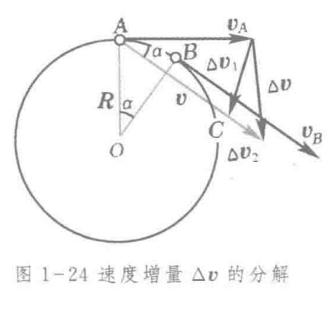

# 普通物理学

## 1. 质点运动学

### 1. 自然坐标系

1. 轨道上质点的位置用某一点开始(原点O)算起的曲线长度S来表征

$$
此时有v=\frac{ds}{dt}
$$

2.  切向加速度 与 法向加速度

1. 以圆代曲 （分析曲线运动的加速度）

用“以圆代曲”的思想，甚至可以导出机械能守恒定律/动能定理
     如在一般曲线上
$$
because\,\,a_t=\frac{dv}{dt}=-g\sin\theta \\\\
thus,\mathrm{d}v=-g\sin\theta\mathrm\,{d}t=-g\frac{dy}{ds}dt\\\\
\mathrm{d}v=\frac{gdy}{v}\\\\
\int_{v_0}^vvdv=-g\int_{y_0}^y \mathrm{d}y\\\\
v^2-v_0^2=2g(y_0-y)
$$

