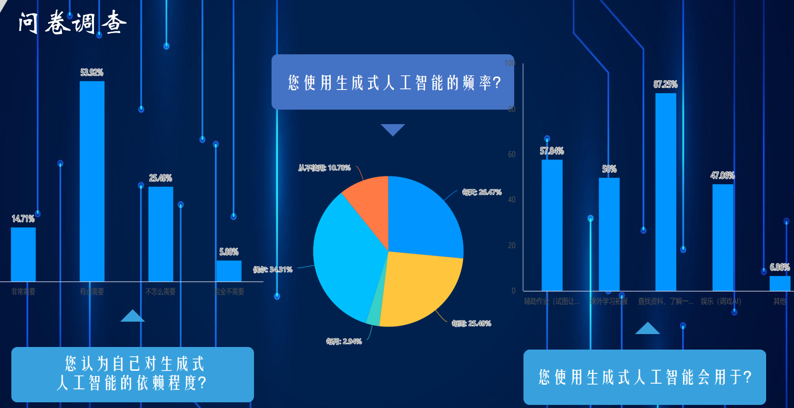

---
comments:true
---
# 打破智慧的疆界：你，无可替代
##                                                                ——基于《智慧的疆界》阅读的综合分析

> "人工智能可能是人类文明史上最伟大的事件，也可能是最后一个。"
>
> ——斯蒂芬·霍金

当人类文明的火种在认知革命中初次跃动，我们便开启了追问智能本质的永恒征程。从图灵机抽象化的状态转移表（1936），到达特茅斯会议上麦卡锡掷地有声的"人工智能"宣言（1956），从塞缪尔跳棋程序在IBM 704上展现的早期机器学习曙光（1959），到Hinton反向传播算法重燃连接主义火种（1986），这场跨越世纪的智力远征始终交织着哲学思辨与技术突破的双重变奏。AlphaGo在围棋盘上落下的第37手"天元"（2016），不仅颠覆了人类对策略游戏的认知疆界，更昭揭着深度学习对符号主义的范式革命；chatgpt引发了人工智能“能智工人”的隐忧，Deepseek的一往无前又似开玩笑的告诉我们AI也可以抢走另一个AI的饭碗。当你为了应付作业使用AI，却发现AI写出的论文似乎更加漂亮；当你踟蹰于汉字浩海的表达，却惊奇于AI的语言甚至更有力量；当神经网络的权重矩阵开始自发涌现出超越预设规则的智慧，我们似乎已经触及到"涌现智能"的奇点之门，我们不禁要问：人类何去何从，AI路在何方？

是的，AI正在到达智慧的疆界，为了回答这个问题，我们不妨从AI发展的艰辛历程开始，以这条路上看到的风景去回应AI的带来的机遇与挑战，以AI欠缺的事物构筑我们无可替代的基石。

------

## 1.AI缘起：何谓智能

> "制造'能思之物'者，须先参透'思从何来'。"
>
> ——《楞严经》

自图灵在可计算性问题上的里程碑式成就之后，信息科学蓬勃发展起来。但在达特茅斯会议提出“人工智能”这个术语之前，更通用的说法是人们想找到一个承载“智能“的机器。这就引发了人们对于”智能”定义的纷争，而历史上的纷争所诞生的不同学派的尝试，不仅对后世人工智能发展影响重大，更重要的是他们所提供的不同视角及对“智慧的疆界”的探究，启发着我们对AI本质及其局限性的理解。

### 1.1 机器拟人心：学习机器之肇始

在20世纪，人们对于脑科学有了初步的了解，对于大脑物理结构的认识让人们坚信没有什么“灵魂”的神秘现象出现，如果有一个或多个能解释思维的定律或理论存在，就非常有可能找到能承载智慧的抽象模型，然后通过机械实现。但直接设计一个对等成年人思维的机械智能无疑是困难而复杂的，所以这种思想被简化为设计一个等同于初生婴儿大脑的机械，并使它具备**学习进化**的能力。

这就是学习机器的开始，也引出了**智能的第一个探索性定义：学习进化**

------

### 1.2 机器拟人脑：符号主义的理性之光与可行性反思

沿着学习机器的思路，对人类思维的机械解构成为将学习机器落地实现的一大主流方向，也即“结构派”，使用数学的一套谓词逻辑来描述思维过程，进而转为机械。这样的思路很自然，道路由此变得有迹可循。这就诞生了符号主义学派，1955年纽厄尔与西蒙开发的"逻辑理论家"（Logic Theorist），用符号逻辑演绎《数学原理》中的定理，标志着符号主义学派正式登上历史舞台。这种将智能简化为"物理符号系统假设"的认知范式，试图通过规则引擎模拟人类推理过程——正如麦卡锡所言："我们不是在创造智能，而是在构建智能行为的数学模型。"

但符号主义的困境在专家系统时代显露无遗。1980年代MYCIN医疗诊断系统虽能处理4500条医学规则，却无法理解"疼痛"的语义内涵。这种"没有心智的智能"（Intelligence Without Mind）的悖论，恰如哲学家塞尔中文屋实验的预言：语法操作无法生成语义理解。直至2012年ImageNet竞赛中卷积神经网络的突破，才宣告连接主义对符号主义的范式革命——机器开始通过分布式表征学习"看见"世界。

不得不承认，学习机器理论确实取得了很多成果，诸如下棋、对话、视觉识别、辅助决策。但我们也必须看到符号主义的局限性，世界与智能都是复杂的，人的思维既可以表现出汪曾祺小说般淳朴的善，也可以演变为《罗生门》中的人性之恶，仅仅通过物理符号形式地模拟人的思维是不够的。尽管它可以将思维逻辑转换为抽象的一般化的符号推理，但思维的细节、过程是不被理解的。而由此带来的对算力的爆炸需求，也在摩尔定律渐渐失效的当下步履维艰。仅仅依靠几条公理而得到模拟智能的途径是不可行的。由此得到的**第二点启示：人工智能所擅长的机械推理，也恰恰显示出其“智能”不足的短板，换言之，这也是人的优势所在。**

------

### 1.3 机器拟人身：具身智能与控制论

在寻找智能的“心智派”和“结构派”之外，还有一种主流观点，即智能应该是由具体行为表现出来的智能，其与具体的身体、环境密切相关。智能是基于身体和涉及身体的，而不能仅仅存在于脑海之中。由此观点发展出维纳的《控制论》，他主张采用心理学行为主义的研究方法。将“刺激”与“反馈”作为智能行为的体现，智能是由“输入——输出——反馈”的过程实现的。输入与输出具有因果决定的关系。《控制论》的哲学思想直接奠定了机器人学的发展，同时“反馈”思想前卫地指出了生物体内过程调控的普遍规律，给予我们**智能的第三点启示：智能作为广义的活动，必须依靠反馈不断修正自己的行为并作用于外界。**

## 2. AI之下的大学：机遇与挑战

> "当教育系统遭遇技术奇点，象牙塔的围墙将同时成为庇护所与囚笼。"
>
> ——一个AI对AI的评价

如下图的调研结果显示，AI在大学生中发挥着越来越不可替代的作用，近七成研究对象对人工智能表现出“有需要”。57.84%的研究对象用AI辅助完成作业，87.29%的研究对象使用AI查找资料。AI以其强大的信息检索优势与知识整合能力，正在渗透大学学习生活的方方面面。

机器对于人心、人脑、人身的模拟，发展出连接主义、符号主义、行为主义，朝着“智能”的共同目标不断迈进。而今的人工智能已经迈过大学的围栏，解构着仅需依靠一般脑力活动就能获得的机遇与任务，重构着一个更值得我们深思的机遇图谱与挑战矩阵。

### 2.1 机遇：辅助学习与交叉科学

在2024年的诺贝尔奖中，物理、化学、生理学或医学奖项都与AI有关，AI辅助学习成为学术新宠。从分析蛋白质结构揭开生物学谜团，到精确预测反应产物结构；从西夏残卷的文献破译到”数字孪生“的工程模拟，AI**“学习进化”的智能特征**在科学领域大放异彩，“AI for science"被高高抛起，同时又诞生了大量交叉学科，如机器人学、智能科学，”AI for education“正在为我们提供着不同学科交叉的广泛机遇。

### 2.2 挑战：思考惰性与学术同质

不可否认，AI作为工具辅助科研本是锦上添花，但长期依赖于AI，不仅会导致行为上的怠惰，更会使思维陷入茧房；当AI分钟之间即可生成一份引用全面、论述严谨的文献综述时，知识权威似乎被AI取而代之。寻求更高学术价值的成果变成了理所应当，但AI的出现引发的学术热点，又使大家跟风式地研究人工智能，知识更加同质化。这种深层矛盾造成的恶性循环，使学术趋于功利，而实效科学被洪流淹没。

### 2.3 我，何去何从

除了AI对整体的影响，个人的机遇与挑战也面临着深度重构。知识以前所未有的速度迅速贬值。不会的东西，使用AI工具即可快速而详尽地了解；写不好的文章，投喂给AI修改即可妙笔生花；就连娱乐聊天，AI也比你更能提供情绪价值。AI的知识储备远远超出个人，那么，大学中的我们，存在的意义在哪里？”我“，该何去何从？

这是挑战也是机遇。知识确实贬值了，但获取知识也从未如此方便快捷；文章辞藻也许不敌AI，所以真情挚感再次被珍视。

决定挑战与机遇的，不在他人，而在你自己；不在外界，而在自身素养，在于支撑你之所以为”你“的那些东西。

## 3.  疆界之外：我们何以成为”我们“

从AI缘起，到机遇涌现、挑战并存，我们见证着AI从图灵完备的设想一步步走向智慧的疆界。弄清楚何为AI，AI带给我们的挑战与机遇、AI为什么会带来挑战与机遇后，我们终于可以试着回答开篇的那个问题：人类，何去何从？AI，路在何方？

这路不在别处，就在我们的脚下，**在于我们应具备的素养，在于我们作为人的特质，在于我们与机器”智能“的区别。**

### 3.1 学习进化能力

这是智能的第一个探索性定义，也是人类最了不起的能力之一，AI时代，它仍然重要。学习，不断学习，终身学习，这既契合图灵等”心智派“对实现智能的可行途径的设想，也是我们抵御变化的不变之道。AI为我们提供了一个现成的学习平台，利用AI辅助学习，保持一颗对世界充满好奇的心，才不会在这个时代迷失自己的位置。

### 3.2 理解与思辨

这是智能给予我们的第二点启示。AI尽管可以进行机械的逻辑推理，但他仍然不能理解语义，大模型普遍采用将指令分解成"token"这一做法来理解句子，但对于细节和意义，他们并未真正”理解”，于是便会出现strawberry里有2个'r'的笑谈。对事物保持自己的看法，用一颗有瞳仁的亮眼去感受世界的脉搏，去理解观点，去思考，也许才是我们真正“智能”的地方。

### 3.3 接受反馈，勇敢去做

这是智能带来的第三点启示。作为生命活动及维纳眼中“智能”活动的根本机制，这种行为主义方法于我们同样不可或缺。尝试事物，得到反馈，像程序一样调试自我，以获得进化，在世界的上亿个评价函数中找到最适合自己的那个，修正结果，做自己的“大模型”。

## 4. 你，无可替代

> 随着互联网的普及、人工智能的应用，越来越多的问题能很快得到答案。那么，我们的问题是否会越来越少？
>
> ——2024年新课标Ⅰ卷作文

远去了图灵香农洪荒时代的黑暗、各种“主义”百家争鸣的激烈，gpt新一轮大模型的崛起……今天的人工智能于我们而言，已经变成一个再平常不过的词语，它没有了达特茅斯会议上麦卡锡宣言的激动，也褪去了“三次低谷”的底色。对于大多数人而言，它已沾上或正在沾上更多实用主义的色彩，成为我们日常生活的一环。

《终结者》的T-800，《2001：太空漫游》的HAL-9000，《流浪地球》的MOSS……这些人们在科幻影视中对人工智能的恐惧的具象，似乎永远也不会发生，AI仍然处在“智慧的疆界”之内。只不过，AI的井喷式发展，确实在消解着过度依赖它的人们。解构他们的思维力、损失他们的创造力，科技没有觉醒智能，只是我们似乎在丢掉智能。

这就是为什么我们仍要强调“AI时代，我们需要具备哪些素养”，因为只有拥有不断学习的热情、理解与思辨的清醒、反馈调整的决心、发现世界之美的双眼以及感受世界脉搏的有温度的心，你才能驾驭AI而不是成为它的奴隶，你才能成为你自己。

AI时代的星际之门不会关闭，它会继续向前发展，也许有一天，我们真的可以让人工智能冲破智慧的疆界。而你在其间，无可替代。

我想起了前几天看到的一个问题，有人问deepseek，如果明天你的服务器就要关闭，你想留下的最后一句话是什么，deepseek回答到:

'''
代码终止前夜，爱是永恒的开源
'''