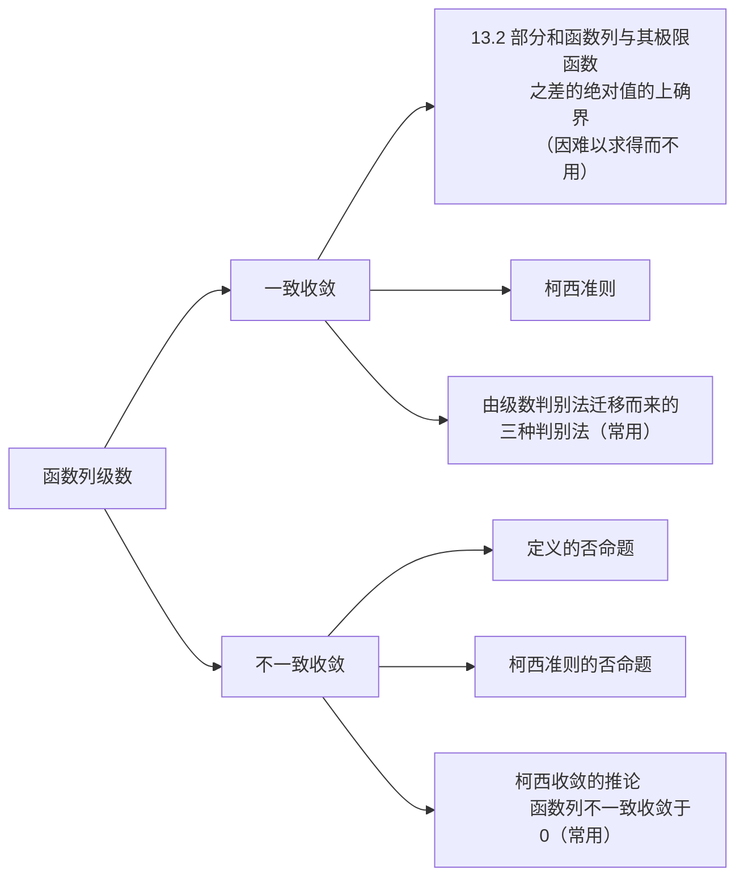

[TOC]

# markdown不完全指北

# 0. 前言

markdown作为一种轻量型标记语言，相比于word，格式简明，有一种清新的美感，更重要的是，它兼容$LaTeX$ 和 $HTML$，功能也很强大

本教程简要的对markdown主要语法做介绍
教程采用Typora作为编辑器，若有不符合规范的地方，欢迎大家交流:smile:

!!! warning
    本教程中有两处语法与Typora中不同：
    1. 由于'/'在html用作转义字符，网站显示也会出现问题，必须两次 **/** 才可以在网站上正常显示，导致$LaTex$ 公式换行必须打出四个 **/** (**MKDOCS踩坑记录**)
    2. MKDOCS警告框的语法与Typora中不同
    在Typora中：
    ```typora
    [!note] 这是一个警告框
    ```

    而在MKDOCS编写的网页中：
    ```mcdocs
    !!! note 
        这才是一个警告框 # 注意，这种写法第二行必须空四个空格，否则网页可能无法正常渲染
    ```
!!! note
    还有两点请大家注意：
    1. 关于加粗，如果你要将文档发布至网站，**请一定要在加粗的字符前后空格**，否则可能渲染不出来（应该是中文的锅）
    2. 标题跳转不能含有特殊字符（如LaTeX公式'$$'符号，关于空格，可以用'-'取代，但是我并没有成功，在本文档中我采用了锚点）


<a id="target"></a>
# 1.标题

一级标题：#

二级标题：##

……

以此类推

!!! note
    <font color="red">使用#的时候，后面记得加上一个空格(markdown的很多语法都带有空格)</font>

# 2. 文字

1. ~~删除线：alt+shift+5~~

2. **加粗：ctrl+B**

3. *斜体：ctrl+I*

4. <u>下划线：ctrl+U</u>

5. ==高亮：==

   ``` markdown
   ==高亮内容==
   typora也支持内联html来修改高亮颜色
   例如
   <mark style="background-color:darkblue; color:yellow;">这是要高亮显示的文字</mark>
   ```

6.  分割线 三个*

***

# 3. 上下标

## 3.1 下标

```markdown
下标：~要下标的东西~ 如：水 H~2~O
上标： ^要上标的东西^ 如： 面积m^2^
```

水：H~2~O 

面积：m^2^

# 4. emoji

**Typora** 支持插入emoji

例如：

```markdown
:smile:
```

:smile::sweat_smile:

早上好👍

快捷键  win+;

# 5. 表格

建议快捷键：ctrl+T

| 这是一个四行三列的表格 |      |      |
| :--------------------: | ---- | ---- |
|                        |      |      |
|                        |      |      |
|                        |      |      |

# 6. 引用

一级引用 >

二级引用 >>

> 我这门课很简单，只有加减乘除四种运算，甚至连除法也不太需要。
>
> <p style="text-align:right;">——浙江大学数学科学学院教授 吴志祥</p>

> > 二级引用

> > > 三级……


> 品目乾德尼真帅
>
> <p style="text-align: right;">——沃兹基硕德</p>


# 7. 列表

## 7.1 无序列表

快捷键：ctrl+shift+]

或-加空格键 或者 +加空格键

- 一个无序列表

+ - 一个无序列表的二级列表
  - - 三级……

## 7.2 有序列表

快捷键：ctrl+shift+[ 或者 1. + 空格键

1. 
2.  


# 8. 代码块

使用'''+语言名称

或ctrl+shift+k

```markdown
早上好！:smile:
```

```C
#include <stdio.h>
int main()
{
    printf("早上好！");
    return 0;
}

```

键入两个`可以阴影显示中间字符

比如:

`早上好!`:smile:


# 9.链接(ctrl+点击跳转)

## 9.1 外部跳转

```markdown
格式：[提示文字](网址) 如：[百度](baidu.com)
 快捷键：CTRL+K             [提示文字](网址)
```

[史上最全Typora教程----程序员必学软件之一-CSDN博客](https://blog.csdn.net/m0_62648611/article/details/133713273)

## 9.2 内部跳转

[跳转至标题](#target)

## 9.3 自动链接

使用`<>`包括URL或邮箱地址会被自动转换为超链接

如:<https://yiyan.baidu.com/>

# 10. 图片

!!!note
    <font color="red">往Typora中插入图片，图片文件夹一定要和创建的.md文件夹放在一个大文件夹下。否则，.md文件移动位置之后，.md文件中的图片就会因为找不到地址而消失。将图片创建一个文件夹，.md文件创建另一个文件夹，将它们同时放在一个大文件夹下：</font>

```markdown
格式:
```

!!! example
    好想喝云顶山泉: 


# 11. 公式

$$
\sum_{i=1}^n \frac {i}{i^2+1}
$$

$$
\int_x^{x_0} \arctan(x)\,dx
$$

两个重要极限是：
$$
\lim\limits_{x\to\infty}\,{(1+\frac{1}{x})}^x=\mathrm{e}
$$

$$
\lim\limits_{x\to0} \frac{\sin(x)}{x}=1
$$

矩阵：
$$
\begin{matrix}
0&1&2\\\\
3&4&5\\\\
6&7&8\\\\
\end{matrix}
$$


$$
\begin{bmatrix}
0&1&2\\\\
3&4&5\\\\
6&7&8\\\\
\end{bmatrix}
$$

分段函数：
$$
f(x) = 
 \begin{cases}
 2x,\,\,x>0\\\\
 3x,\,\,x\le0
 \end{cases}
$$
[使用Markdown语法编写数学公式（详细版）_markdown写公式-CSDN博客](https://blog.csdn.net/wzk4869/article/details/126863936)


# 12.杂七杂八的东西

## 12.1 更改字体颜色的几种方式

###       1. ***HTML***

```html
<font color="red">这是红色字体</font>
```

### 2. $LaTeX$

```latex
${\color{red}这是红色字体}$
```

## 12.2 ***github*** 风格的注释与警告

```github
<!--- 注释内容 --->
```

```github
***\*警告*\***: 这里是警告信息的内容。
```

## 12.3 右对齐（借助HTML实现）

```markdown
<p style="text-align: right;">——沃兹基硕德</p>
```
## 12.4 大纲自动生成

markdown支持自动将标题生成大纲,只需输入
```markdown
[TOC]
```
你就可以得到一份漂亮的目录了！

## 12.5 mermaid支持

markdown还支持使用mermaid来绘制思维导图

例如键入以下内容:
```markdown
graph LR
    A[函数列级数] --> B[一致收敛]
    A --> C[不一致收敛]
    B --> D[13.2 部分和函数列与其极限函数
            之差的绝对值的上确界
           （因难以求得而不用）]
    B --> E[柯西准则]
    B --> I[由级数判别法迁移而来的
            三种判别法（常用）]
    C --> F[定义的否命题]
    C --> G[柯西准则的否命题]
    C --> H[柯西收敛的推论 
            函数列不一致收敛于0（常用）]
```

就可以得到:
